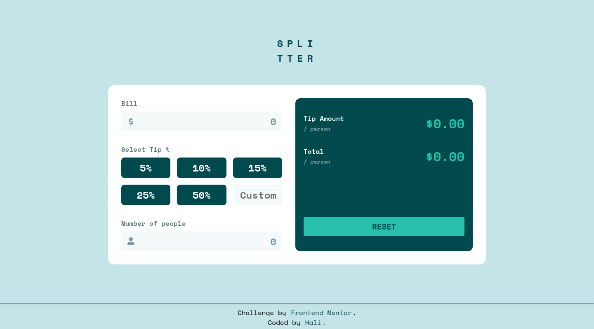

# Frontend Mentor - Tip calculator app solution

This is a solution to the [Tip calculator app challenge on Frontend
Mentor](https://www.frontendmentor.io/challenges/tip-calculator-app-ugJNGbJUX).
Frontend Mentor challenges help you improve your coding skills by building
realistic projects.

## Table of contents

- [Overview](#overview)
  - [The challenge](#the-challenge)
  - [Screenshot](#screenshot)
  - [Links](#links)
- [My process](#my-process)
  - [Built with](#built-with)
  - [What I learned](#what-i-learned)
  - [Useful resources](#useful-resources)
- [Author](#author)

## Overview

### The challenge

Users should be able to:

- View the optimal layout for the app depending on their device's screen size
- See hover states for all interactive elements on the page
- Calculate the correct tip and total cost of the bill per person

### Screenshot

### Links

- [Solution URL](https://www.frontendmentor.io/solutions/vuejs-3-mobile-first-tip-calculator-0BoPL5lG1)
- [Live Site URL](https://halivert.dev/tip-calculator-app)

## My process

### Built with

- Semantic HTML5 markup
- CSS custom properties
- Flexbox
- Mobile-first workflow
- [Vue.js](https://v3.vuejs.org/) - JS framework
- [Font awesome](https://fontawesome.com/) - Icon library

### What I learned

In this project I leared to use Vue.js 3 and their new composition API. 
Also I estimate 15 hours for this project but in the end I did it in 13.

I like to put special attention to details, like hover, focus and focus-visible
effects.

### Useful resources

- [Vue.js 3 documentation](https://v3.vuejs.org/guide/) - This helped me for
  understand the new composition API and examples in Single File Components.

## Author

- Website - [halivert](https://halivert.dev)
- Frontend Mentor - [@halivert](https://www.frontendmentor.io/profile/halivert)
- Twitter - [@halivert](https://www.twitter.com/halivert)
